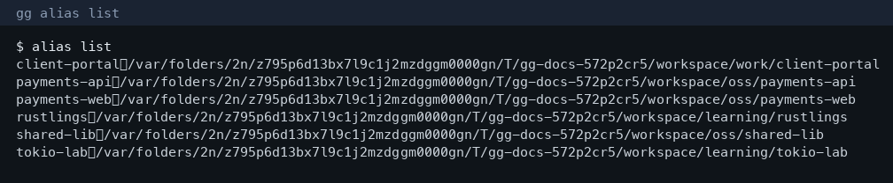

# Interactive config (wizard & TUI)

git-gist ships two interactive front-ends for managing aliases, groups, tags, remotes, auto-enroll rules, and settings — so you rarely need to hand-edit TOML.

Both call the same mutation layer as the scriptable CLI (`gg alias add`, `gg group member add`, …).

| | Wizard | TUI |
|--|--------|-----|
| Command | `gg config wizard` / `gg wizard` | `gg config ui` / `gg ui` |
| Style | Sequential prompts (`inquire`) | Full-screen tabs (`ratatui`) |
| Best for | Quick edits, SSH, first-time setup | Browsing large catalogs, bulk prune |
| Scoped entry | `gg alias wizard`, `gg group wizard`, … | `gg alias ui`, `gg group ui`, … |

Requires a TTY. Incompatible with `--format json`.


## Wizard

```bash
gg config wizard          # hub menu
gg wizard                 # same
gg alias wizard           # jump to aliases
gg group wizard
gg tag wizard
gg remotes wizard
gg config enroll wizard
```

On a TTY, `gg config` with no subcommand also opens the hub.

Hub menu:

```
What would you like to manage?
  > Aliases
    Groups
    Tags
    Remotes
    Auto-enroll rules
    Settings
    Prune stale aliases
    Preview & save
    Quit
```

- **Hub** accumulates changes and saves from **Preview & save**.
- **Scoped** wizards (`gg alias wizard`, …) save immediately after you confirm a change.


### Typical flows

**Add an alias**

1. `gg alias wizard` → Add  
2. Enter name + path  
3. Config is saved under `~/.git-gist/config.toml`

**Fix stale aliases after moving projects**

1. `gg doctor --config` — lists aliases whose paths are missing  
2. `gg alias wizard` → Prune stale (or `gg alias prune`)  
3. `gg update --prune-stale` — enroll again with short names reclaimed  

**Narrow auto-enroll so groups stay curated**

1. `gg config enroll wizard` → Add rule  
2. Set `path` to your workspace and `path_prefix` to e.g. `oss/`  
3. Assign `groups = ["oss"]` only for that prefix  


## TUI

```bash
gg config ui              # all tabs
gg ui                     # same
gg alias ui               # Aliases tab only
gg group ui
gg tag ui
gg remotes ui
gg config enroll ui
```

Keybindings:

| Key | Action |
|-----|--------|
| `j` / `k` or arrows | Move selection |
| `Tab` / `←` `→` | Switch tabs (hub only) |
| `d` | Delete selected row |
| `p` | Prune stale aliases |
| `s` | Save |
| `q` | Quit (`Q` forces quit with unsaved changes) |


## Scriptable alternatives

Everything the wizard/TUI can do is also available non-interactively:

```bash
gg alias add api ~/src/api
gg alias prune --dry-run
gg group member add oss api
gg group prune oss --under ~/src/oss
gg tag add learning rustlings
gg config enroll add ~/src --path-prefix oss/ --to-group oss
gg config set show_path true
gg config edit            # $EDITOR
gg doctor --config
```



## Selection & overview (for context)

After aliases/groups are set, filters behave as expected — human mode prints a short selection summary on stderr:


## Regenerating screenshots

Screenshots in `docs/src/images/` are produced from **synthetic** repos (not a developer’s real tree):

```bash
cargo build --release
python3 -m pip install pillow   # once
python3 scripts/docs-screenshots.py
```
