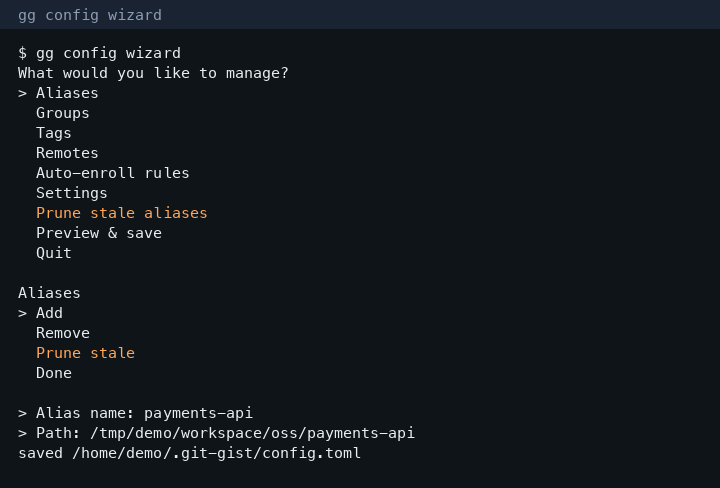
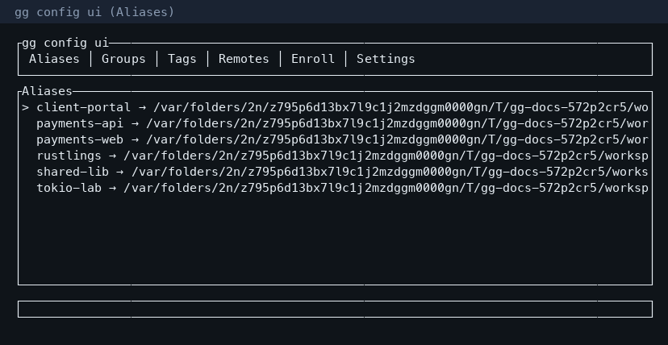

# Configuration

## Locations

| Scope | Path |
|-------|------|
| Global | `~/.git-gist/config.toml` |
| Local | `.gg.toml` or `.git-gist.toml` (ancestors of cwd) |
| Ignore | `.ggignore` at search root |
| Cache / state | `~/.git-gist/discovery.json`, `~/.git-gist/state.json` |

Legacy configs under `~/.config/git-gist/` or `~/Library/Application Support/git-gist/` are **copied once** into `~/.git-gist/config.toml` on first load.

Example file: [`examples/config.toml`](https://github.com/chtnnh/git-gist/blob/main/examples/config.toml).

## Schema

`schema_version = 1` — bump with migrations documented in CHANGELOG.

Keys: `root`, `depth`, `jobs`, `ignore`, `aliases`, `groups`, `tags`, `remotes`, `profiles`, `hook_packs`, `theme`, `include_submodules`, `show_path`, `repo_overrides`, `auto_enroll`.

```bash
gg config show
gg config path
gg config get depth
gg config set depth 8
gg config edit          # $EDITOR
gg alias add api ~/src/api
gg group add work api web
gg tag add learning chess-engine
gg doctor --config
```

CLI overrides for one invocation: `--root`, `--depth`, `-j`, `--theme`, `--include-submodules`, `--show-path`.

## Interactive config UX

Prefer the wizard or TUI when exploring or bulk-editing. Full walkthrough (keybindings, scoped commands, screenshots): **[Interactive config](./interactive)**.

```bash
gg config wizard    # or: gg wizard
gg config ui        # or: gg ui
gg alias wizard     # scoped prompts
gg alias ui         # scoped full-screen
```

On a TTY, `gg config` with no subcommand launches the wizard hub.






## Auto-enroll

Declare watch folders. New git repos are enrolled into aliases / groups / tags **automatically** (throttled) when you run selection commands. `gg update` remains a manual force / dry-run fallback.

```toml
[[auto_enroll]]
path = "/home/you/src"
path_prefix = "learning/"   # optional — only enroll under this relative prefix
depth = 6
tags = ["learning"]

[[auto_enroll]]
path = "/home/you/src"
path_prefix = "oss/"
depth = 6
groups = ["oss"]
```

```bash
gg update --dry-run              # preview
gg update                        # force enroll now
gg update --prune-stale          # drop dead aliases first (reclaim short names)
gg update --ask                  # confirm prune interactively
gg config enroll list
gg config enroll add ~/src --path-prefix oss/ --to-group oss
```


Notes:

- Prefer `path_prefix` (or a narrow `path`) when assigning `groups`/`tags` — watching your entire `root` with `groups = ["oss"]` will put every repo in that group.
- Existing aliases are left in place; missing group/tag membership is repaired.
- Alias names prefer the directory basename, then a path-derived name, then numeric suffixes on collision.
- Stale aliases (missing paths) block short names — use `gg alias prune` or `gg update --prune-stale`.
- Missing watch roots are reported as warnings (`gg doctor --config`).
- Unknown TOML keys are detected with **edit-distance suggestions** (e.g. `auto_enrol` → `auto_enroll`, `show_pth` → `show_path`); serde still ignores them until fixed.

## Hygiene commands

```bash
gg alias prune --dry-run
gg alias prune
gg group prune oss --under ~/src/oss
gg group member add oss new-repo
gg group member remove oss old-repo
gg doctor --config
```


## Themes

`theme = "default" | "mono" | "vivid"` (or `--theme` on the CLI). Overview / sync / stale tables use semantic cell colors for dirty trees, stale ages (≥30d / ≥90d), and ahead/behind drift.

## Show path with repo name

`show_path = true` (or `--show-path`) prints `name (relative-or-absolute path)` in human overview / sync / stale / commits / doctor / worktrees tables. JSON still uses separate `name` and `path` fields. Relative paths are preferred when the repo is under `--root` / config `root`.
